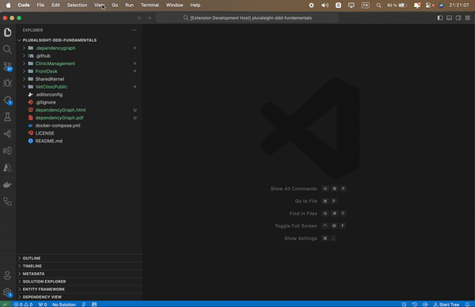

# dependency-visualizer README 

Dependency Visualizer is a VS Code extension that helps you visualize the dependencies in your project. It provides a tree view of your project's dependencies, a graphical representation of the dependencies, and options to save the graph as HTML or PDF.

<!--  -->

## Features

- **Refresh Dependencies Tree View:** Refreshes the tree view to reflect the current state of your project's dependencies.
- **Show Dependencies Graph:** Displays a graphical representation of your project's dependencies.
- **Save Dependencies Graph to HTML:** Saves the graphical representation of your dependencies as an HTML file.
- **Save Dependencies Graph to PDF:** Saves the graphical representation of your dependencies as a PDF file.

## Commands

The following commands are available in the Dependency Visualizer extension:

1. **Refresh Dependencies Tree View**
   - **Command:** `dv.rd`
   - **Title:** Refresh Dependencies tree view
   - **Description:** Refreshes the tree view to reflect the current state of your project's dependencies.

2. **Show Dependencies Graph**
   - **Command:** `dv.showGraph`
   - **Title:** Show Dependencies Graph
   - **Description:** Displays a graphical representation of your project's dependencies.

3. **Save Dependencies Graph to HTML**
   - **Command:** `dv.saveDependencyGraph`
   - **Title:** Save dependencies graph into HTML
   - **Description:** Saves the graphical representation of your dependencies as an HTML file.

4. **Save Dependencies Graph to PDF**
   - **Command:** `dv.printDependencyGraph`
   - **Title:** Save Dependencies into PDF file
   - **Description:** Saves the graphical representation of your dependencies as a PDF file.

## Usage

### Refresh Dependencies Tree View

To refresh the dependencies tree view, open the Command Palette (Ctrl+Shift+P) and type `Refresh Dependencies tree view`, then press Enter. This will refresh the tree view to reflect the current state of your project's dependencies.

### Show Dependencies Graph

To show the dependencies graph, open the Command Palette (Ctrl+Shift+P) and type `Show Dependencies Graph`, then press Enter. This will open a new panel displaying a graphical representation of your project's dependencies.

### Save Dependencies Graph to HTML

To save the dependencies graph as an HTML file, open the Command Palette (Ctrl+Shift+P) and type `Save dependencies graph into HTML`, then press Enter. You will be prompted to select a directory where the HTML file will be saved.

### Save Dependencies Graph to PDF

To save the dependencies graph as a PDF file, open the Command Palette (Ctrl+Shift+P) and type `Save Dependencies into PDF file`, then press Enter. You will be prompted to select a directory where the PDF file will be saved.

### GIF Demo

## Installation

1. Open VS Code.
2. Go to the Extensions view by clicking on the Extensions icon in the Activity Bar on the side of the window or by pressing `Ctrl+Shift+X`.
3. Search for "Dependency Visualizer".
4. Click Install to install the extension.
5. Once installed, you can start using the commands listed above.

## Contributing

If you find any issues or have suggestions for new features, please create an issue or a pull request in the [GitHub repository](https://github.com/ALWANM/dependency-visualizer.git).

## License

This extension is licensed under the [MIT License](LICENSE).
